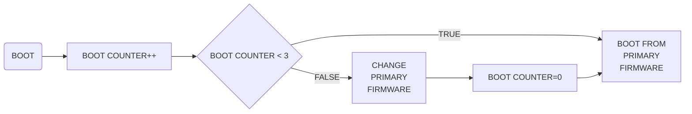

## Brief
One of the requirements of the Acubesat/peaksat missions is to have two firmwares installed on the OBC. In order to be able to assess the health of the primary firmware, and boot from the secondary firmware if needed, a custom dual-boot bootloader was developed. Its objective is to count the unsuccessful boot tries, select the correct firmware to boot from and pass information to the firmware. The firmware needs to be able to reset the unsuccessful boot counter and change the order in which the bootloader tries to boot from.
A high level flow chart of the bootloader logic is shown in the figure below.


## Usage

The bootloader is a precompiled binary file. The only thing necessary to use it is to upload it correctly. One easy way to do it is to use OpenOCD. If you already have it you can just run the command:
```shell
openocd -f atmel_samv71_xplained_ultra.cfg -c "program bootloader.bin 0x00400000 verify reset exit"
```
If you get a “memory region is locked message”, the MCU probably already has a version of the bootloader installed. Erase the chip and try again. After erasing the chip you will also need to set the GPNVM boot mode selection bit using [these](https://gitlab.com/acubesat/software-management/-/wikis/ATSAM/Running-code-on-an-ATSAMV71Q21B-for-the-first-time) instructions.
Make sure to **UPDATE YOUR LINKER SCRIPT** so that you have the correct memory map. After uploading the bootloader the primary firmware will start at address 0x00406000 and will have a maximum size of 1012 kB.
For development purposes, you might need a way to boot from the primary firmware regardless of the boot counter. To do this you can load the [reset_boot.bin](https://github.com/PeakSat/OBC-bootloader/tree/reset-counter/bin) binary at 0x00503000, using the instructions on the readme of thet branch. This program resets the counter once the bootloader branches to it, and it branches to the first firmware.


## High Level Explanation
The bootloader starts by copying the variables from a memory location which is shared with the firmwares. One of the variables stored there is the boot counter. Every time the bootloader is executed, it adds 1 to that variable. It is the firmwares responsibility to reset the boot counter to 0. If it fails to do so, the bootloader will assume that the firmware did not boot correctly and boot from the secondary firmware.

The next variable sets the primary firmware. At any given time there will be two firmwares installed on the internal flash of the ATSAMV71Q21B. The location of the primary firmware might change, thus primary firmware does not mean the first firmware in memory. For example, a new firmware upload might be put at the second memory partition. Then the bootloader should be informed that the second partition contains the primary firmware by changing the appropriate variable on the shared memory. On the next boot, the bootloader will boot on the second partition, which contains the primary firmware.

After reading these variables, the bootloader can decide the appropriate firmware to boot from. Before branching to the correct memory address, it needs to erase the shared memory and write the buffer with the updated variables to the memory. The erase is necessary since only 0s can be programed in the type of memory that the MCU is using.

Finally the bootloader can branch to the firmwares entry point. Two things need to be implemented in the firmware for the bootloader to work correctly. One is the reset of the boot counter, which should happen at every successful boot and the second is to change the primary boot variable after a successful firmware upgrade.
